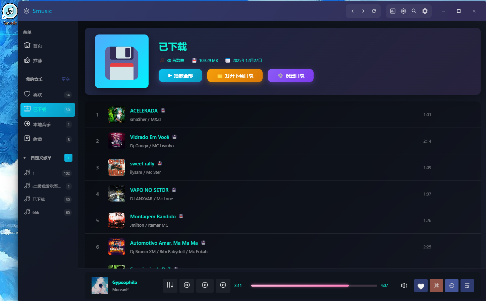
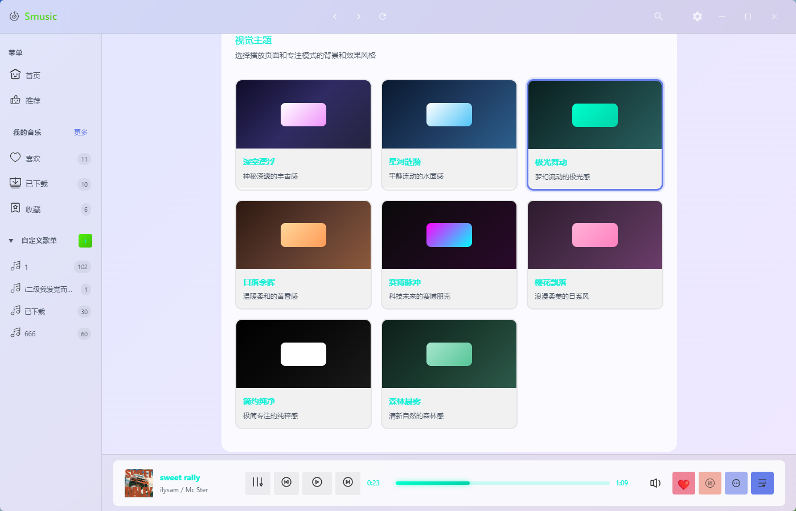
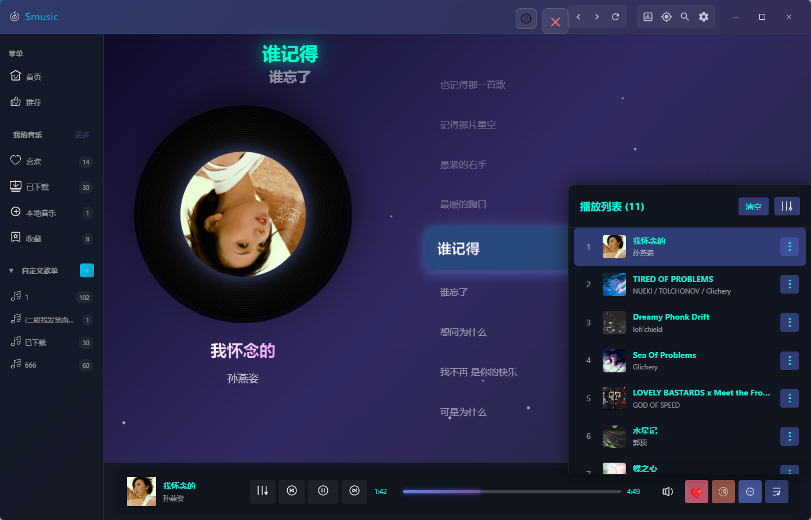
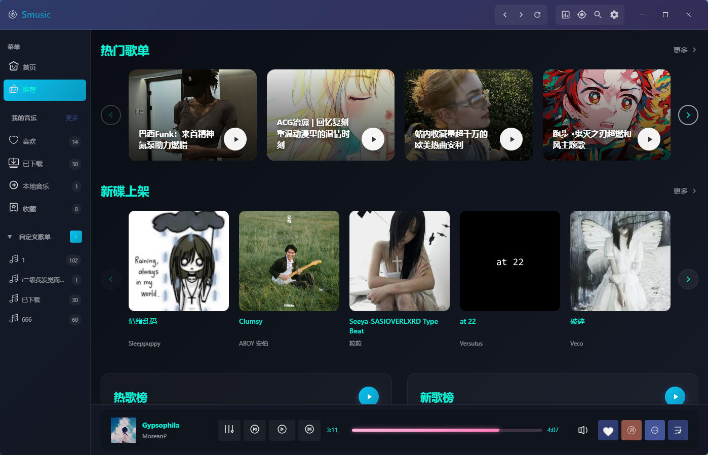
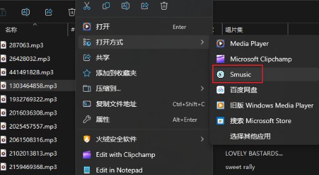
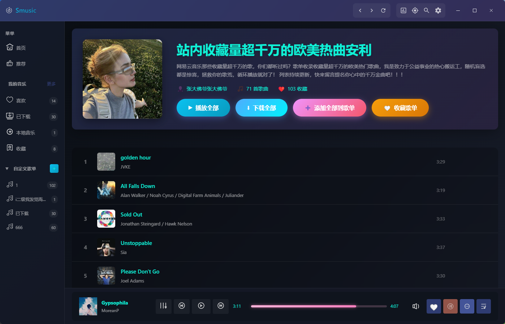

# 🎵 Smusic - Vue3 + Electron 音乐播放器

一个基于 Vue3 + Electron 的现代化桌面音乐播放器，支持网易云音乐搜索、播放、灰色歌曲解灰、本地音乐管理等功能。

这里特别感谢[音乐来源(api-enhanced)](https://github.com/NeteaseCloudMusicApiEnhanced/api-enhanced)，没有大佬的开源，我这个个人玩具也做不起来。也希望我的项目能帮到各位，并做得更好用
## ✨ 示例图片








### 核心功能
- 🔍 **歌曲搜索** - 搜索歌曲、歌手、专辑、歌单
- 🎵 **音乐播放** - 在线播放网易云音乐 + 本地音乐播放
- 🔓 **灰色歌曲解灰** - 自动从多音源获取无版权歌曲
- 📝 **歌词显示** - 普通歌词 桌面歌词窗口
- 🎼 **歌单管理** - 创建自定义歌单、收藏在线歌单、我喜欢的音乐
- 💾 **下载管理** - 批量下载歌曲、下载进度显示、自动写入 ID3 标签
- 🎨 **主题定制** - 深色/浅色模式、多种强调色、视觉效果

### 高级功能
- 🖥️ **桌面歌词** - 独立桌面歌词窗口，支持锁定、拖动、大小调整
- ⌨️ **全局快捷键** - 支持全局/应用内快捷键控制播放
- 📂 **本地音乐** - 导入本地 MP3 文件，自动读取 ID3 标签
- 🔄 **播放模式** - 顺序播放、随机播放、单曲循环
- 🎯 **系统托盘** - 最小化到托盘、托盘控制播放
- 💾 **状态持久化** - 播放列表、播放进度、设置自动保存

## 🛠️ 技术栈

### 前端
- **Vue 3** - 渐进式 JavaScript 框架
- **Vite** - 下一代前端构建工具
- **Electron** - 跨平台桌面应用框架
- **Pinia** - 状态管理库
- **Vue Router** - 路由管理
- **Naive UI** - UI 组件库
- **Axios** - HTTP 客户端

### 后端服务
- **api-enhanced** (端口 3000) - 网易云音乐 API 代理（内置多音源解灰功能）
  - 基于 NeteaseCloudMusicApi
  - 集成 UnblockNeteaseMusic 解灰功能
  - 支持酷我、酷狗、咪咕、QQ音乐等多音源

## 📦 项目结构

```
Smusic/
├── src/
│   ├── main.js                    # 应用入口
│   ├── App.vue                    # 根组件
│   ├── desktop-lyric-main.js     # 桌面歌词入口
│   ├── api/                       # API 接口
│   │   ├── request.js             # Axios 配置
│   │   └── music.js               # 音乐 API
│   ├── stores/                    # Pinia 状态管理
│   │   ├── player.js              # 播放器状态
│   │   ├── theme.js               # 主题状态
│   │   ├── shortcuts.js           # 快捷键状态
│   │   └── download.js            # 下载状态
│   ├── components/                # 组件
│   │   ├── PlayerBar.vue          # 播放器控制条
│   │   ├── Sidebar.vue            # 侧边栏
│   │   ├── TitleBar.vue           # 自定义标题栏
│   │   ├── DesktopLyric.vue       # 桌面歌词
│   │   ├── LyricsPanel.vue        # 歌词面板
│   │   ├── DownloadManager.vue    # 下载管理器
│   │   └── ...                    # 其他组件
│   ├── pages/                     # 页面
│   │   ├── Home.vue               # 首页
│   │   ├── Discover.vue           # 发现页
│   │   ├── Search.vue             # 搜索页
│   │   ├── Playlist.vue           # 歌单详情
│   │   ├── Album.vue              # 专辑详情
│   │   ├── MyPlaylists.vue        # 我的歌单
│   │   ├── CollectedPlaylists.vue # 收藏的歌单
│   │   ├── LocalPlaylist.vue      # 本地音乐
│   │   ├── Settings.vue           # 设置页
│   │   └── ...                    # 其他页面
│   ├── router/                    # 路由配置
│   │   └── index.js
│   ├── utils/                     # 工具函数
│   └── styles/                    # 样式文件
├── lib/                           # 核心库
│   ├── FileManager.js             # 文件管理
│   ├── PlaylistManager.js         # 歌单管理
│   └── DownloadManager.js         # 下载管理
├── services/
│   └── api-enhanced/              # 网易云音乐 API 服务
├── assets/                        # 资源文件
│   ├── icon.png
│   └── icon.ico
├── index.html                     # 主窗口 HTML
├── desktop-lyric.html             # 桌面歌词 HTML
├── vite.config.js                 # Vite 配置
├── electron-main.js               # Electron 主进程
├── preload.js                     # 预加载脚本
├── package.json                   # 项目配置
└── README.md                      # 项目说明
```

## 🚀 快速开始

### 环境要求
- Node.js >= 16.x
- npm >= 8.x

### 1. 克隆项目

```bash
git clone <repository-url>
cd Smusic
```

### 2. 安装依赖

```bash
npm install
```

### 3. 启动应用

```bash
# 启动 Electron 应用（会自动启动 api-enhanced 服务）
npm run electron-dev
```

应用启动时会自动：
1. 启动 Vite 开发服务器（端口 5173）
2. 启动 api-enhanced 服务（端口 3000）
3. 打开 Electron 窗口

### 4. 仅开发前端（不需要 Electron）

```bash
# 启动 Vite 开发服务器
npm run dev
```

此时需要手动启动 api-enhanced：
```bash
cd services/api-enhanced
node app.js
```

### 5. 构建应用

```bash
# 构建前端资源
npm run build

# 打包 Electron 应用
npm run electron-build
```

打包后的安装程序位于 `dist/` 目录。

## ⚠️ 重要说明

### 关于灰度歌曲

**什么是灰度歌曲？**
- 灰度歌曲是指因版权限制无法完整播放的歌曲
- 表现：页面显示完整时长（如 3:00），但实际只能播放 30 秒

**如何解决？**
1. **api-enhanced 服务会自动启动**（Electron 应用启动时自动启动）
2. api-enhanced 内置了多音源解灰功能（基于 UnblockNeteaseMusic）
3. 应用会自动检测灰度歌曲并从其他音源（酷我、酷狗、咪咕、QQ音乐等）获取完整版本
4. 如果仍无法播放，检查控制台日志

**支持的音源：**
- bodian（波点音乐）
- kuwo（酷我音乐）
- kugou（酷狗音乐）
- migu（咪咕音乐）
- qq（QQ音乐）
- pyncmd（第三方网易云API）

**检查服务状态：**
```bash
# 测试 api-enhanced
curl http://localhost:3000/search/suggest?keywords=test

# 测试解灰功能
curl "http://localhost:3000/song/url/match?id=1901371647"
```

## 📝 主要功能说明

### 1. 歌曲搜索与播放

- 支持搜索歌曲、歌手、专辑、歌单
- 自动解灰无版权歌曲
- 支持在线播放和本地播放

### 2. 歌单管理

- **我喜欢的音乐**：收藏喜欢的歌曲
- **自定义歌单**：创建、编辑、删除自己的歌单
- **收藏的歌单**：收藏网易云在线歌单
- **已下载**：管理已下载的歌曲

### 3. 下载功能

- 单曲下载和批量下载
- 实时显示下载进度
- 自动写入 ID3 标签（歌名、歌手、专辑、封面）
- 自动保存歌词文件（.lrc）
- 支持自定义下载目录

### 4. 桌面歌词

- 独立桌面歌词窗口
- 支持拖动和锁定
- 支持大小调整
- 鼠标悬停显示控制按钮

### 5. 快捷键

支持全局快捷键和应用内快捷键：
- 播放/暂停：`Ctrl+Alt+P`
- 上一首：`Ctrl+Alt+Left`
- 下一首：`Ctrl+Alt+Right`
- 音量增加：`Ctrl+Alt+Up`
- 音量减少：`Ctrl+Alt+Down`

可在设置中自定义快捷键。

### 6. 主题定制

- 深色/浅色模式
- 多种强调色可选
- 视觉效果开关（粒子效果、音频可视化等）

## 🔧 配置说明

### API 端口配置

默认使用端口 3000，如需修改，编辑 `src/api/request.js`：

```javascript
export const apiRequest = axios.create({
  baseURL: 'http://localhost:3000',  // 修改端口
  timeout: 10000
})
```

### 数据存储位置

应用数据存储在系统用户目录：
- **Windows**: `%APPDATA%/Smusic/`
- **macOS**: `~/Library/Application Support/Smusic/`
- **Linux**: `~/.config/Smusic/`

包含：
- `favorites.json` - 我喜欢的音乐
- `custom-playlists.json` - 自定义歌单
- `collected-playlists.json` - 收藏的歌单
- `downloads.json` - 已下载歌曲
- `settings.json` - 应用设置
- `downloads/` - 下载的音乐文件

### 自定义下载目录

在设置页面可以修改下载目录位置。

## 🎯 开发指南

详细的开发文档请参考 [MUSIC_PLAYER_DEV_GUIDE.md](./MUSIC_PLAYER_DEV_GUIDE.md)

### 开发模式

```bash
# 启动 Vite 开发服务器
npm run dev

# 启动 Electron 开发模式
npm run electron-dev
```

### 调试

- 主窗口：按 `F12` 打开开发者工具
- 桌面歌词窗口：开发模式下自动打开 DevTools

### 项目架构

- **前端**：Vue 3 + Vite + Naive UI
- **状态管理**：Pinia + pinia-plugin-persistedstate
- **路由**：Vue Router
- **桌面框架**：Electron
- **核心库**：FileManager、PlaylistManager、DownloadManager

## 📚 相关资源

- [api-enhanced](https://github.com/NeteaseCloudMusicApiEnhanced/api-enhanced) - 网易云音乐 API（内置解灰功能）
- [Vue 3 文档](https://vuejs.org/)
- [Electron 文档](https://www.electronjs.org/docs)
- [Vite 文档](https://vitejs.dev/)
- [Naive UI 文档](https://www.naiveui.com/)

## 🐛 常见问题

### Q: API 服务未响应？
A: 确保 api-enhanced 服务已启动，检查端口 3000 是否被占用。

### Q: 灰色歌曲无法播放？
A: api-enhanced 会自动从多音源获取，如果所有音源都无法获取，则该歌曲无法播放。

### Q: 下载的歌曲在哪里？
A: 默认在用户数据目录的 `downloads/` 文件夹，可在设置中查看和修改。

### Q: 如何导入本地音乐？
A: 在"本地音乐"页面点击"导入音乐"按钮，选择 MP3 文件。

### Q: 快捷键不生效？
A: 检查设置中快捷键模式（全局/应用内），确保没有与其他应用冲突。

## 📄 许可证

MIT License

## 🤝 贡献

欢迎提交 Issue 和 Pull Request！

## 📮 联系方式

如有问题或建议，请提交 Issue。

---

**最后更新**: 2025 年 12 月 28 日